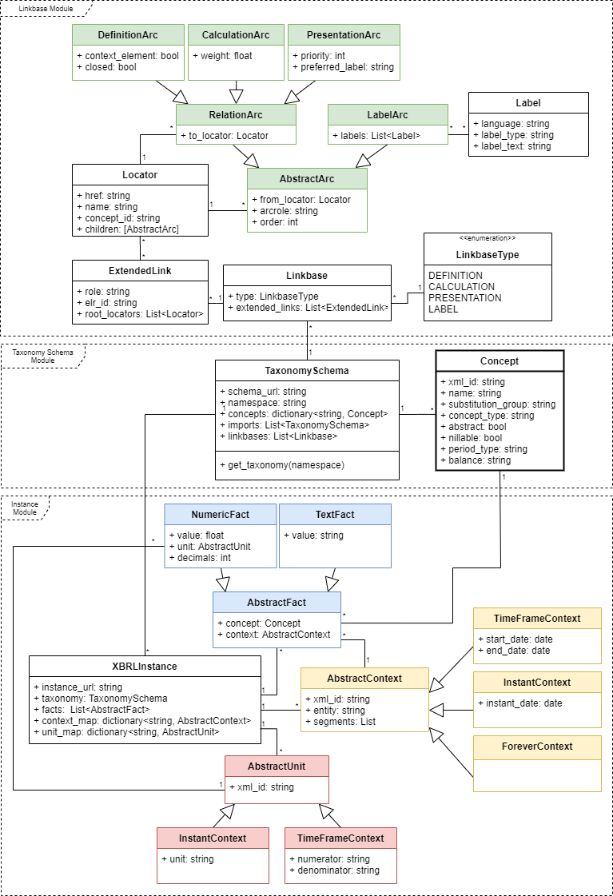

## XBRL-Parser

[](https://www.python.org/)

<!--
[](https://www.python.org/doc/versions/)
[](https://pypi.python.org/pypi/ansicolortags/)
[](https://github.com/m4nu3l99/xbrl_parser/master/LICENSE)
[](https://pypi.python.org/pypi/ansicolortags/)
[](https://pypi.python.org/pypi/ansicolortags/)
-->

> #### DISCLAIMER - BETA PHASE
> This xbrl-parser is currently in a beta phase. Each new release can introduce breaking changes.
> 


This is the documentation for the XBRL Parser. The XBRL Parser consists of 3 Modules. The Instance Document
module, the Taxonomy-Schema module and the Linkbase module.

The functionality and interactions between the different modules are outlined in my bachelor thesis. 
The goal of this documentation is to explain how to use the various modules of the XBRL Parser.

### 1 Instance document module
For a quick start just import the parse_XBRL_instance_file or the parse_iXBRL_file and insert the
link to the instance document. The parser will automatically download the Taxonomy-schema as well as all
Taxonomies and Linkbases used by the Instance Document.

__XBRL Instance Document__
```python
from src.xbrl.parser.classes.XbrlInstance import parse_xbrl_instance_file, XbrlInstance

instance_url: str = 'https://www.sec.gov/Archives/edgar/data/320193/000032019318000145/aapl-20180929.xml'
inst: XbrlInstance = parse_xbrl_instance_file(instance_url)
print(inst)
```
``OUT: Instance Document aapl-20200926.htm with 1329 facts``

If the logging level is lower or equal then INFO the CacheHelper will print out the urls that where
cached. These are displayed in the details sections. 

It should be noted that the instance file and the extension taxonomy schema are downloaded first. 
Then the parser recursively goes through all the taxonomy imports and downloads them.
When all the underlying taxonomies are downloaded and parsed, the linkbases of the extension taxonomy 
are read in.

Click on details for the full logs

<details>

```
INFO:src.helper.CacheHelper:200 https://www.sec.gov/Archives/edgar/data/320193/000032019320000096/aapl-20200926.htm
INFO:src.helper.CacheHelper:200 https://www.sec.gov/Archives/edgar/data/320193/000032019320000096/aapl-20200926.xsd
INFO:src.helper.CacheHelper:200 http://xbrl.fasb.org/srt/2020/elts/srt-2020-01-31.xsd
INFO:src.helper.CacheHelper:200 http://www.xbrl.org/2003/xbrl-instance-2003-12-31.xsd
INFO:src.helper.CacheHelper:200 http://www.xbrl.org/2003/xbrl-linkbase-2003-12-31.xsd
INFO:src.helper.CacheHelper:200 http://www.xbrl.org/2003/xl-2003-12-31.xsd
INFO:src.helper.CacheHelper:200 http://www.xbrl.org/2003/xlink-2003-12-31.xsd
INFO:src.helper.CacheHelper:200 http://www.xbrl.org/dtr/type/numeric-2009-12-16.xsd
INFO:src.helper.CacheHelper:200 http://www.xbrl.org/dtr/type/nonNumeric-2009-12-16.xsd
INFO:src.helper.CacheHelper:200 http://www.xbrl.org/2005/xbrldt-2005.xsd
INFO:src.helper.CacheHelper:200 http://www.xbrl.org/2006/ref-2006-02-27.xsd
INFO:src.helper.CacheHelper:200 http://xbrl.fasb.org/srt/2020/elts/srt-types-2020-01-31.xsd
INFO:src.helper.CacheHelper:200 http://xbrl.fasb.org/us-gaap/2020/elts/us-gaap-2020-01-31.xsd
INFO:src.helper.CacheHelper:200 http://xbrl.fasb.org/us-gaap/2020/elts/us-types-2020-01-31.xsd
INFO:src.helper.CacheHelper:200 http://xbrl.fasb.org/us-gaap/2020/elts/us-roles-2020-01-31.xsd
INFO:src.helper.CacheHelper:200 http://xbrl.fasb.org/us-gaap/2020/elts/us-gaap-eedm-def-2020-01-31.xml
INFO:src.helper.CacheHelper:200 http://xbrl.fasb.org/srt/2020/elts/srt-eedm1-def-2020-01-31.xml
INFO:src.helper.CacheHelper:200 https://xbrl.sec.gov/country/2020/country-2020-01-31.xsd
INFO:src.helper.CacheHelper:200 https://xbrl.sec.gov/dei/2020/dei-2020-01-31.xsd
INFO:src.helper.CacheHelper:200 https://www.sec.gov/Archives/edgar/data/320193/000032019320000096/aapl-20200926_cal.xml
INFO:src.helper.CacheHelper:200 https://www.sec.gov/Archives/edgar/data/320193/000032019320000096/aapl-20200926_def.xml
INFO:src.helper.CacheHelper:200 https://www.sec.gov/Archives/edgar/data/320193/000032019320000096/aapl-20200926_lab.xml
INFO:src.helper.CacheHelper:200 https://www.sec.gov/Archives/edgar/data/320193/000032019320000096/aapl-20200926_pre.xml
OUT: Instance Document aapl-20200926.htm with 1329 facts
```

</details>

<br>

__Inline XBRL Instance Document__
```python
from xbrl_parser.instance import parse_ixbrl_instance, XbrlInstance
from xbrl_parser.cache import HttpCache

instance_url: str = 'https://www.sec.gov/Archives/edgar/data/320193/000032019320000096/aapl-20200926.htm'
cache: HttpCache = HttpCache('./cache/')

inst: XbrlInstance = parse_ixbrl_instance(cache, instance_url)
print(inst)
```
``OUT: Instance Document aapl-20200926.htm with 1344 facts``

Both functions return exactly the same object structure. So a parsed XBRL Filing looks the same as a parsed iXBRL file.
This structure is further explained in Point 4. 


### 2 Taxonomy-schema module
The taxonomy schema module is responsible for parsing the taxonomy schema.
This includes parsing the concepts defined in the taxonomy and extracting linkbase references.
The following example code parses the main entry point for the ESEF taxonomy.
The logging output beneath displays all other taxonomy-schemas and linkbases that where imported 
by the taxonomy and thus had also to be downloaded and parsed.

```python
from xbrl_parser.taxonomy import parse_taxonomy, TaxonomySchema
from xbrl_parser.cache import HttpCache

schema_url: str = 'https://www.esma.europa.eu/taxonomy/2019-03-27/esef_cor.xsd'
cache: HttpCache = HttpCache('./cache/')

tax: TaxonomySchema = parse_taxonomy(cache, schema_url)
```

Output:
<details>

```
INFO:src.helper.CacheHelper:200 https://www.esma.europa.eu/taxonomy/2019-03-27/esef_cor.xsd
INFO:src.helper.CacheHelper:200 http://www.xbrl.org/2003/xbrl-instance-2003-12-31.xsd
INFO:src.helper.CacheHelper:200 http://www.xbrl.org/2003/xbrl-linkbase-2003-12-31.xsd
INFO:src.helper.CacheHelper:200 http://www.xbrl.org/2003/xl-2003-12-31.xsd
INFO:src.helper.CacheHelper:200 http://www.xbrl.org/2003/xlink-2003-12-31.xsd
INFO:src.helper.CacheHelper:200 http://www.esma.europa.eu/taxonomy/ext/technical.xsd
INFO:src.helper.CacheHelper:200 http://www.xbrl.org/2005/xbrldt-2005.xsd
INFO:src.helper.CacheHelper:200 http://www.xbrl.org/taxonomy/int/lei/CR/2018-11-01/lei-required.xsd
INFO:src.helper.CacheHelper:200 http://www.xbrl.org/taxonomy/int/lei/CR/2018-11-01/lei.xsd
INFO:src.helper.CacheHelper:200 http://www.xbrl.org/taxonomy/int/lei/CR/2018-11-01/lei-formula.xml
INFO:src.helper.CacheHelper:200 http://www.xbrl.org/taxonomy/int/lei/CR/2018-11-01/lei-label.xml
INFO:src.helper.CacheHelper:200 http://www.xbrl.org/taxonomy/int/lei/CR/2018-11-01/lei-required-formula.xml
INFO:src.helper.CacheHelper:200 http://xbrl.ifrs.org/taxonomy/2019-03-27/full_ifrs/labels/in_full_ifrs-en_2019-03-27.xml
INFO:src.helper.CacheHelper:200 http://xbrl.ifrs.org/taxonomy/2019-03-27/full_ifrs/labels/lab_full_ifrs-en_2019-03-27.xml
INFO:src.helper.CacheHelper:200 http://xbrl.ifrs.org/taxonomy/2019-03-27/full_ifrs/labels/doc_full_ifrs-en_2019-03-27.xml
INFO:src.helper.CacheHelper:200 http://xbrl.ifrs.org/taxonomy/2019-03-27/full_ifrs/linkbases/ias_1/ref_ias_1_2019-03-27.xml
INFO:src.helper.CacheHelper:200 http://xbrl.ifrs.org/taxonomy/2019-03-27/full_ifrs/linkbases/ias_10/ref_ias_10_2019-03-27.xml
INFO:src.helper.CacheHelper:200 http://xbrl.ifrs.org/taxonomy/2019-03-27/full_ifrs/linkbases/ias_12/ref_ias_12_2019-03-27.xml
INFO:src.helper.CacheHelper:200 http://xbrl.ifrs.org/taxonomy/2019-03-27/full_ifrs/linkbases/ias_16/ref_ias_16_2019-03-27.xml
INFO:src.helper.CacheHelper:200 http://xbrl.ifrs.org/taxonomy/2019-03-27/full_ifrs/linkbases/ias_19/ref_ias_19_2019-03-27.xml
INFO:src.helper.CacheHelper:200 http://xbrl.ifrs.org/taxonomy/2019-03-27/full_ifrs/linkbases/ias_2/ref_ias_2_2019-03-27.xml
INFO:src.helper.CacheHelper:200 http://xbrl.ifrs.org/taxonomy/2019-03-27/full_ifrs/linkbases/ias_20/ref_ias_20_2019-03-27.xml
INFO:src.helper.CacheHelper:200 http://xbrl.ifrs.org/taxonomy/2019-03-27/full_ifrs/linkbases/ias_21/ref_ias_21_2019-03-27.xml
INFO:src.helper.CacheHelper:200 http://xbrl.ifrs.org/taxonomy/2019-03-27/full_ifrs/linkbases/ias_23/ref_ias_23_2019-03-27.xml
INFO:src.helper.CacheHelper:200 http://xbrl.ifrs.org/taxonomy/2019-03-27/full_ifrs/linkbases/ias_24/ref_ias_24_2019-03-27.xml
INFO:src.helper.CacheHelper:200 http://xbrl.ifrs.org/taxonomy/2019-03-27/full_ifrs/linkbases/ias_26/ref_ias_26_2019-03-27.xml
INFO:src.helper.CacheHelper:200 http://xbrl.ifrs.org/taxonomy/2019-03-27/full_ifrs/linkbases/ias_27/ref_ias_27_2019-03-27.xml
INFO:src.helper.CacheHelper:200 http://xbrl.ifrs.org/taxonomy/2019-03-27/full_ifrs/linkbases/ias_29/ref_ias_29_2019-03-27.xml
INFO:src.helper.CacheHelper:200 http://xbrl.ifrs.org/taxonomy/2019-03-27/full_ifrs/linkbases/ias_33/ref_ias_33_2019-03-27.xml
INFO:src.helper.CacheHelper:200 http://xbrl.ifrs.org/taxonomy/2019-03-27/full_ifrs/linkbases/ias_34/ref_ias_34_2019-03-27.xml
INFO:src.helper.CacheHelper:200 http://xbrl.ifrs.org/taxonomy/2019-03-27/full_ifrs/linkbases/ias_36/ref_ias_36_2019-03-27.xml
INFO:src.helper.CacheHelper:200 http://xbrl.ifrs.org/taxonomy/2019-03-27/full_ifrs/linkbases/ias_37/ref_ias_37_2019-03-27.xml
INFO:src.helper.CacheHelper:200 http://xbrl.ifrs.org/taxonomy/2019-03-27/full_ifrs/linkbases/ias_38/ref_ias_38_2019-03-27.xml
INFO:src.helper.CacheHelper:200 http://xbrl.ifrs.org/taxonomy/2019-03-27/full_ifrs/linkbases/ias_40/ref_ias_40_2019-03-27.xml
INFO:src.helper.CacheHelper:200 http://xbrl.ifrs.org/taxonomy/2019-03-27/full_ifrs/linkbases/ias_41/ref_ias_41_2019-03-27.xml
INFO:src.helper.CacheHelper:200 http://xbrl.ifrs.org/taxonomy/2019-03-27/full_ifrs/linkbases/ias_7/ref_ias_7_2019-03-27.xml
INFO:src.helper.CacheHelper:200 http://xbrl.ifrs.org/taxonomy/2019-03-27/full_ifrs/linkbases/ias_8/ref_ias_8_2019-03-27.xml
INFO:src.helper.CacheHelper:200 http://xbrl.ifrs.org/taxonomy/2019-03-27/full_ifrs/linkbases/ifric_2/ref_ifric_2_2019-03-27.xml
INFO:src.helper.CacheHelper:200 http://xbrl.ifrs.org/taxonomy/2019-03-27/full_ifrs/linkbases/ifric_5/ref_ifric_5_2019-03-27.xml
INFO:src.helper.CacheHelper:200 http://xbrl.ifrs.org/taxonomy/2019-03-27/full_ifrs/linkbases/ifrs_1/ref_ifrs_1_2019-03-27.xml
INFO:src.helper.CacheHelper:200 http://xbrl.ifrs.org/taxonomy/2019-03-27/full_ifrs/linkbases/ifrs_12/ref_ifrs_12_2019-03-27.xml
INFO:src.helper.CacheHelper:200 http://xbrl.ifrs.org/taxonomy/2019-03-27/full_ifrs/linkbases/ifrs_13/ref_ifrs_13_2019-03-27.xml
INFO:src.helper.CacheHelper:200 http://xbrl.ifrs.org/taxonomy/2019-03-27/full_ifrs/linkbases/ifrs_14/ref_ifrs_14_2019-03-27.xml
INFO:src.helper.CacheHelper:200 http://xbrl.ifrs.org/taxonomy/2019-03-27/full_ifrs/linkbases/ifrs_15/ref_ifrs_15_2019-03-27.xml
INFO:src.helper.CacheHelper:200 http://xbrl.ifrs.org/taxonomy/2019-03-27/full_ifrs/linkbases/ifrs_16/ref_ifrs_16_2019-03-27.xml
INFO:src.helper.CacheHelper:200 http://xbrl.ifrs.org/taxonomy/2019-03-27/full_ifrs/linkbases/ifrs_17/ref_ifrs_17_2019-03-27.xml
INFO:src.helper.CacheHelper:200 http://xbrl.ifrs.org/taxonomy/2019-03-27/full_ifrs/linkbases/ifrs_2/ref_ifrs_2_2019-03-27.xml
INFO:src.helper.CacheHelper:200 http://xbrl.ifrs.org/taxonomy/2019-03-27/full_ifrs/linkbases/ifrs_3/ref_ifrs_3_2019-03-27.xml
INFO:src.helper.CacheHelper:200 http://xbrl.ifrs.org/taxonomy/2019-03-27/full_ifrs/linkbases/ifrs_4/ref_ifrs_4_2019-03-27.xml
INFO:src.helper.CacheHelper:200 http://xbrl.ifrs.org/taxonomy/2019-03-27/full_ifrs/linkbases/ifrs_5/ref_ifrs_5_2019-03-27.xml
INFO:src.helper.CacheHelper:200 http://xbrl.ifrs.org/taxonomy/2019-03-27/full_ifrs/linkbases/ifrs_6/ref_ifrs_6_2019-03-27.xml
INFO:src.helper.CacheHelper:200 http://xbrl.ifrs.org/taxonomy/2019-03-27/full_ifrs/linkbases/ifrs_7/ref_ifrs_7_2019-03-27.xml
INFO:src.helper.CacheHelper:200 http://xbrl.ifrs.org/taxonomy/2019-03-27/full_ifrs/linkbases/ifrs_8/ref_ifrs_8_2019-03-27.xml
INFO:src.helper.CacheHelper:200 http://xbrl.ifrs.org/taxonomy/2019-03-27/full_ifrs/linkbases/sic_29/ref_sic_29_2019-03-27.xml
INFO:src.helper.CacheHelper:200 https://www.esma.europa.eu/taxonomy/2019-03-27/esef_cor-for.xml
INFO:src.helper.CacheHelper:200 https://www.esma.europa.eu/taxonomy/2019-03-27/esef_cor-dim.xml
```

</details>


### 3 Linkbase module
With the linkbase module you can parse linkbases. Due to their similar structure all linkbase
objects use the same class. The type of the linkbase is specified by the enum "LinkbaseType" 
and stored in the parameter "type" of the linkbase class.


```python
from xbrl_parser.linkbase import parse_linkbase, Linkbase, LinkbaseType
from xbrl_parser.cache import HttpCache

cache: HttpCache = HttpCache('./cache/')

label_linkbase: str = 'https://www.sec.gov/Archives/edgar/data/320193/000032019318000145/aapl-20180929_lab.xml'
definition_linkbase: str = 'https://www.sec.gov/Archives/edgar/data/320193/000032019318000145/aapl-20180929_def.xml'
calculation_linkbase: str = 'https://www.sec.gov/Archives/edgar/data/320193/000032019318000145/aapl-20180929_cal.xml'
presentation_linkbase: str = 'https://www.sec.gov/Archives/edgar/data/320193/000032019318000145/aapl-20180929_pre.xml'

lab_link: Linkbase = parse_linkbase(cache, label_linkbase, LinkbaseType.LABEL)
def_link: Linkbase = parse_linkbase(cache, label_linkbase, LinkbaseType.DEFINITION)
cal_link: Linkbase = parse_linkbase(cache, label_linkbase, LinkbaseType.CALCULATION)
pre_link: Linkbase = parse_linkbase(cache, label_linkbase, LinkbaseType.PRESENTATION)

```


### 4 XBRL Object instances
The parser stores the parsed filing into a structure of object instances. This structure will be
explained in the following diagram.


